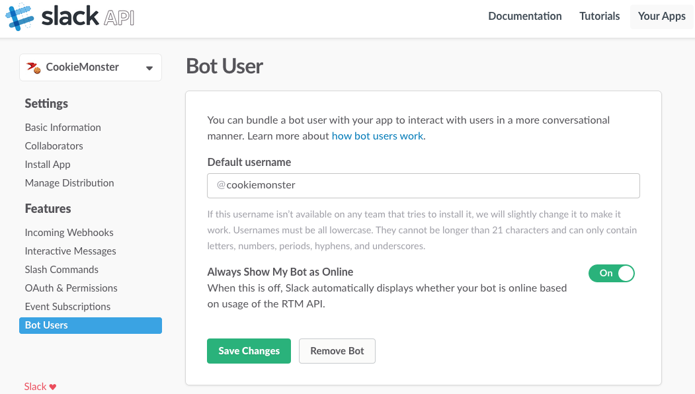
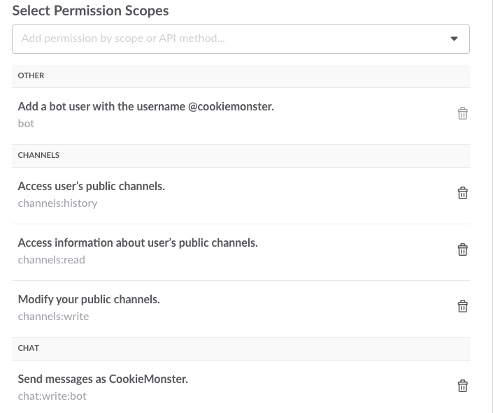
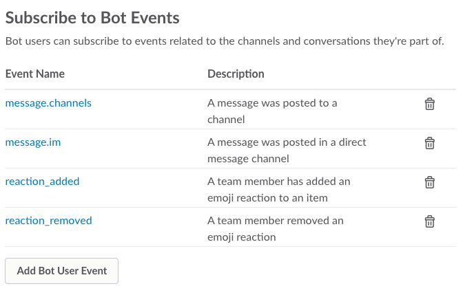
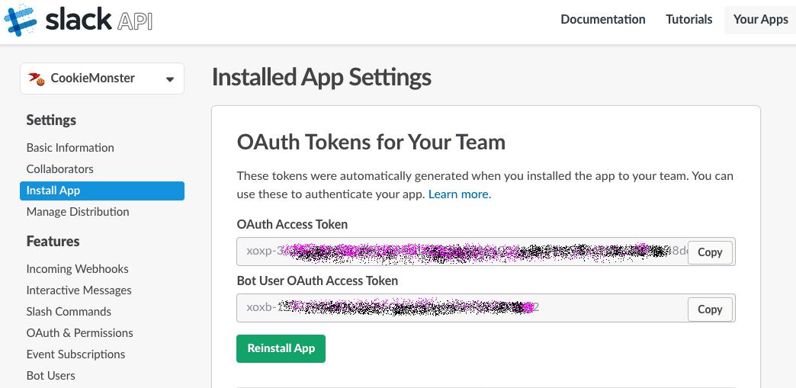
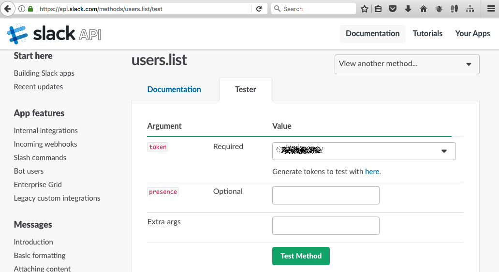
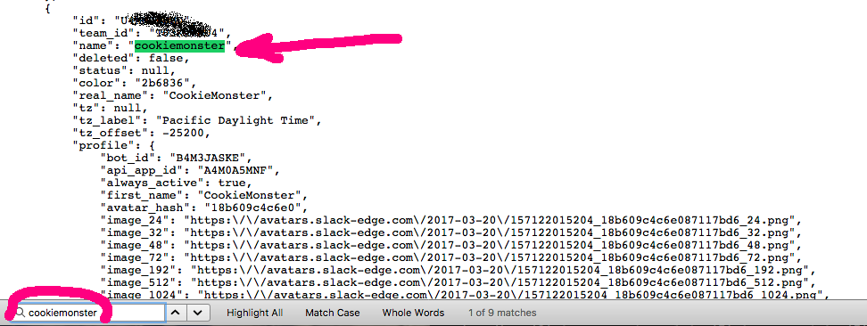
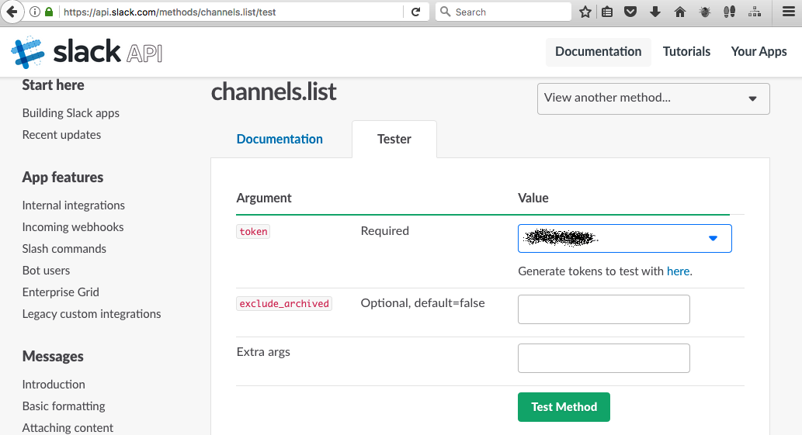
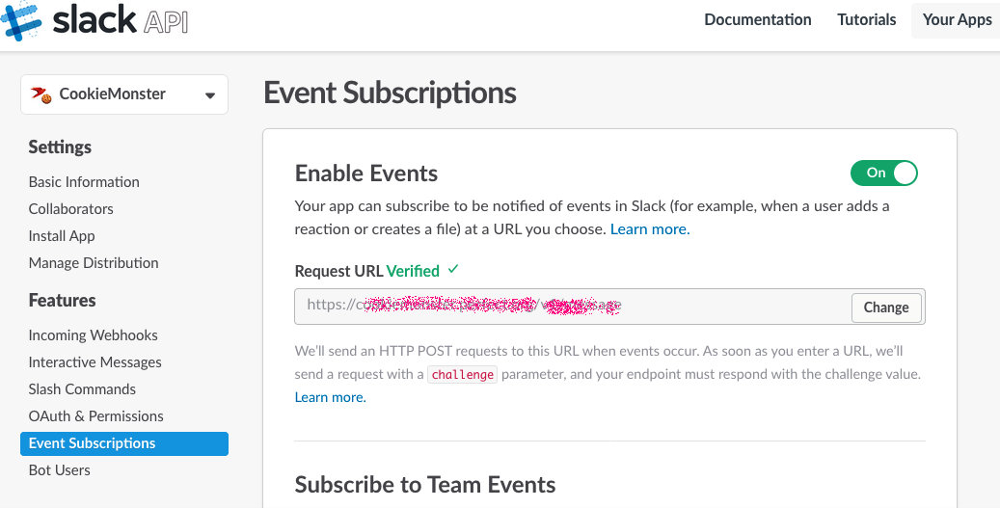

# Perfect Slack 聊天机器人 [English](README.md)

<p align="center">
    <a href="http://perfect.org/get-involved.html" target="_blank">
        
    </a>
</p>

<p align="center">
    <a href="https://github.com/PerfectlySoft/Perfect" target="_blank">
        
    </a>  
    <a href="http://stackoverflow.com/questions/tagged/perfect" target="_blank">
        
    </a>  
    <a href="https://twitter.com/perfectlysoft" target="_blank">
        
    </a>  
    <a href="http://perfect.ly" target="_blank">
        
    </a>
</p>

<p align="center">
    <a href="https://developer.apple.com/swift/" target="_blank">
        
    </a>
    <a href="https://developer.apple.com/swift/" target="_blank">
        
    </a>
    <a href="http://perfect.org/licensing.html" target="_blank">
        
    </a>
    <a href="http://twitter.com/PerfectlySoft" target="_blank">
        
    </a>
    <a href="http://perfect.ly" target="_blank">
        
    </a>
</p>

本项目是专门为Slack聊天机器人定制的模板服务器。
在本项目模板中，一个聊天机器人可以加入授权频道，读取频道内所有用户发送的“曲奇🍪”并记录在案，而且可以直接答复用户的有关曲奇🍪饼干的问题。

## 预备知识

在您决定编译、测试或者部署您自己的基于Perfect软件框架体系的聊天机器人之前，以下基础知识⚠️不可或缺⚠️：

- [Perfect 基础](http://www.perfect.org/docs/gettingStartedFromScratch_zh_CN.html)
- [Slack API 在线函数接口参考](https://api.slack.com)
- 提前准备好具有有效域名（FQDN）并由认证机构颁发证书的服务器
- [Perfect 软件助手](http://www.perfect.org/en/assistant/) 可以用来编译和测试。这是可选的，但是如果您没有安装助手，则建议您自行在本地计算机上准备一个Ubuntu 16.04 LTS 虚拟服务器或者Docker镜像并自行安装好Swift 3.0以上版本。

## 快速上手

### 第一步：复制本项目

请使用下列命令复制本项目：

```
$ git clone https://github.com/PerfectServers/SlackBot.git
```

本工程根目录之下有一个 `config.json.sample` 文件，所有内容都是必须填写的配置项：

``` json
{
  "token": "xoxb-您的Slack应用程序通行证-TOKENXXXXXXXXXXXXXXXXX",
  "bot" : "聊天机器人名称",
  "bot_id": "聊天机器人编号",
  "client_id": "XXXXXXXX.YYYYYYYYYY您的应用程序编号",
  "client_secret": "应用程序密码",
  "verify_token": "反向验证通行证，即Slack在访问您的服务器是验证一下究竟是不是Slack发来的请求",
  "oauth_uri": "/v1/oauth接口函数地址",
  "message_uri": "/v1/msg接口函数地址",
  "confirm_uri": "/v1/confirm接口函数地址",
  "serverName": "yourhost.yourcompany.domain您的服务器完整域名",
  "cerPath": "/opt/certificates/yourcertificate.crt您的自签证书和第三方认证证书的合并文件",
  "keyPath": "/opt/certificates/yourcertificate.key您的证书私有钥匙文件",
  "dbPath": "/var/opt/yoursqlite.db数据库文件",
  "runAs": "yourUserName您的服务器普通用户名",
  "port": 443,
  "channels": {
    "channel1_id": "channel1_name需要监听的频道",
    "channel2_id": "channel2_name需要监听的频道"
  }
}
```

上述文件的所有详细编写说明请参考本文后续内容。

### 第二步：到您的Slack团队上自行注册一个应用程序

- 在您的 [Slack API 网页](https://api.slack.com)上，选择 "Your Apps"创建新的应用程序
- 聊天机器人用户：为您的机器人起名字并应用到配置： <br>

- 增加权限。在本案例中，权限至少包括"bot user"（聊天机器人）、"channels:history"（公共频道历史）、"channels.read"（公共频道可读）、"channels.write"（公共频道可写）和 "chart:write:bot" （机器人可以发送聊天信息）。<br>

- 订阅事件：本案例需要至少以下事件在Slack应用程序控制台中进行订阅操作：(1) `message.channels`（监听频道消息）; (2) `message.im`（实现即时通信）; (3) `reaction_added`（增加表情）; (4) `reaction_removed`（删除表情）。<br>

- 通过设置请求URL激活上述事件订阅。比如您的聊天机器人所在主机域名为`myhost.com`，而且接口程序入口点 `message_uri` 配置为 `/v1/msg`，那么请将该url设置为`https://myhost.com/v1/msg`。⚠️注意⚠️目前Slack仅支持HTTPS即443端口。

- 将您的应用程序安装到您的团队中去。<br>

如果所有工作完成，请将上述配置信息逐一输入到您的`config.json`文件，其中 `token`指的是 *`Bot User OAuth Access Token`*（聊天机器人授权访问通行证）

### 第三步：获取聊天机器人编号（概念有难度，操作须谨慎）

Slack 聊天机器人需要在编程时使用自己的编号（不是屏幕上显示的名称）。要获得该编号需要一定技巧，请仔细阅读以下说明：

- 打开浏览器导航至 [`users.list` Slack API page](https://api.slack.com/methods/users.list/test) <br>

- 为您的应用程序选择适合的通行证并点击在线测试 `Test Method`
- 如果成功，则点击打开原始响应链接`(open raw response)`，可以看到一个JSON数据结构
- 在JSON字符串中搜索您的聊天机器人名称
- 将找到的聊天机器人编号拷贝到前文配置中<br>


### 第三步：选择待监控频道（概念有难度，操作须谨慎）

该操作时可选项，但是出于安全角度来说，还是推荐完成的。

虽然相信许多聊天机器人开发商都希望其机器人产品能够加入的频道或者私聊群越多越好，但是您可能希望将聊天机器人县治在某几个特定的频道或者群聊中。

为了实现这个目标，请采用下列操作：

- 打开浏览器并导航至 [`channels.list` Slack API page](https://api.slack.com/methods/channels.list/test)
- 选择团队开发通行证并点击测试方法 `Test Method`<br>

- 如果查询成功，请点击原始响应数据 `(open raw response)` 查看返回的JSON数据。
- 选择需要监控的频道并记录待监控频道的名称和代码（`id` / `name`），并将其填写到您的`config.json` 文件中。

*注意* 如果您希望您的聊天机器人能够访问所有频道，则直接将下列代码粘贴到您的源程序内即可：

``` swift
Curl("https://slack.com/api/channels.list?token=\(token)") { ret in
  do {
    guard let b = ret,
      let info = try b.jsonDecode() as? [String:Any],
      let ok = info["ok"] as? Bool,
      let channels = info["channels"] as? [Any] else {
        Print("channel parse::ok(fault)")
        return nil
    }//end guard
    guard ok, channels.count > 0 else {
      Print("channel parse::ok(\(ok))")
      return nil
    }//end
    channels.forEach { channel in
      let ch = channel as? [String: Any] ?? [:]
      guard let id = ch["id"] as? String,
      let name = ch["name"] as? String else {
        return
      }//end guard

      // CAUTION: Append all channels into the cache
      global.channels[id] = name
    }//next
  }catch(let err) {
    Print("parseChannels::\(err)")
    return nil
  }// end do  
}//end curl
```

### 第五步：编译和部署聊天机器人服务器

在此推荐使用 [Perfect Assistant 软件助手](http://www.perfect.org/en/assistant/)完成所有编译和部署的自动化操作。

但是，如果您使用的不是亚马逊AWS弹性计算EC2或者谷歌云，那么您需要详细了解整个安装部署的详细步骤。工程根目录下有一个安装脚本可供参考`install.sh.sample`：

- (1) 在您本地的 Ubuntu 16.04，比如虚拟机或者Docker上，编译服务器，命令行为`$ swift build -c release` 编译为正式发行版本
- (2) 用scp命令将二进制可执行的发行文件上传到服务器（可以和Swift运行函数库一起打包上传）
- (3) 将配置好的 `config.service` 和 `config.json` 文件上传到服务器。其中 `config.service`模板文件可参考本工程根目录下的范例。
- (4) 将您所有的证书文件放置到服务器安全、合理的路径下，并为运行提供足够但安全的权限。
- (5) 在服务器上修改`config.json`文件并保证其中所有的变量，特别时各个路径，比如证书路径和数据库都完全符合实际部署。
- (6) 同样如有必要，在服务器上也修改 `config.service`以匹配所有路径。
- (7) 使用命令 `$ sudo systemctl enable config.service` 将您的新应用程序注册为Linux系统服务，这样服务器在重启后就能自动以管理员方式启动。
- (8) 启动服务器，您可以选择重启整个服务器，或者运行 `$ sudo systemctl restart slackbot`命令行单独启动目标服务程序（假设编译后的服务命令行为 `slackbot`）

如果没有Perfect软件助手，则上述所有步骤一样是有一些难度的，因此操作时需要特别小心。请仔细阅读下列样本文件范例：

#### Config.service 服务注册文件参考范例

```
[Unit]
Description=您的聊天机器人

[Service]
Type=simple
WorkingDirectory=/var/opt
ExecStart=/path/to/yourApp/PerfectTemplate
Restart=always
PIDFile=/var/run/yourSlackBotApp.pid
Environment="LD_LIBRARY_PATH=/usr/lib:/usr/local/lib:/usr/local/lib/swift"

[Install]
WantedBy=multi-user.target
```

#### 安装脚本范例

```
# 安装部署脚本范例
# 假设您的服务器应用程序名为`slackbot`
# 请保证您的服务器上已经提前安装了Swift运行环境，比如
# LD_LIBRARY_PATH="/usr/lib/yourSwiftInstalationPath"
# 变量定义如下：
RPO=slackbot
TGZ=/tmp/$RPO.tgz
SVC=$RPO.service
CFG=$RPO.json
APP=/tmp/app.tgz
SERVER=yoursshLoginUserName@yourhost.yourdomain
LOCALVM=your.local.ubuntu.virtual.machine

# 首先把源代码打包并传输到虚拟机上
tar czvf $TGZ Package.swift Sources
scp $TGZ $LOCALVM:/tmp

# 通过虚拟机进行编译
ssh $LOCALVM "cd /tmp;rm -rf $RPO;mkdir $RPO; cd $RPO; tar xzvf $TGZ;swift build -c release;cd .build/release;tar czvf $APP PerfectTemplate *.so"

# 然后再从虚拟机上取回编译好的二进制文件并上传至生产服务器
scp $LOCALVM:$APP $APP
scp $APP $SERVER:$APP
scp $SVC $SERVER:/tmp/$SVC
scp $CFG $SERVER:/tmp/$CFG

# 在生产服务器上执行安装并将新编应用程序注册为Linux操作系统服务
ssh $SERVER "cd /opt;sudo -S rm -rf $RPO;sudo -S mkdir $RPO;cd $RPO;sudo -S tar xzvf $APP;sudo -S cp /tmp/$SVC .;sudo -S cp /tmp/$CFG .;sudo -S systemctl disable $RPO;sudo -S systemctl enable /opt/$RPO/$SVC;sudo -S systemctl start $RPO;sudo -S systemctl status $RPO"
```

### 第六步：返回到Slack应用程序控制台

一旦重启服务器后，请回到Slack应用程序的控制台网页确认上述服务器并激活所有功能，特别时OAuth配置认证页面：

- 验证事件订阅请求接口`Request URL` <br>
- 现在打开Slack应用，进入您的目标频道，并将机器人邀请到频道。⚠️注意⚠️选择增加一个测试频道专门用于调试聊天机器人是一个好主意
- 测试聊天机器人，可以直接对它发起会话聊天

## 问题报告、内容贡献和客户支持

我们目前正在过渡到使用JIRA来处理所有源代码资源合并申请、修复漏洞以及其它有关问题。因此，GitHub 的“issues”问题报告功能已经被禁用了。

如果您发现了问题，或者希望为改进本文提供意见和建议，[请在这里指出](http://jira.perfect.org:8080/servicedesk/customer/portal/1).

在您开始之前，请参阅[目前待解决的问题清单](http://jira.perfect.org:8080/projects/ISS/issues).


## 更多信息
关于本项目更多内容，请参考[perfect.org](http://perfect.org).

## 扫一扫 Perfect 官网微信号
<p align=center></p>
